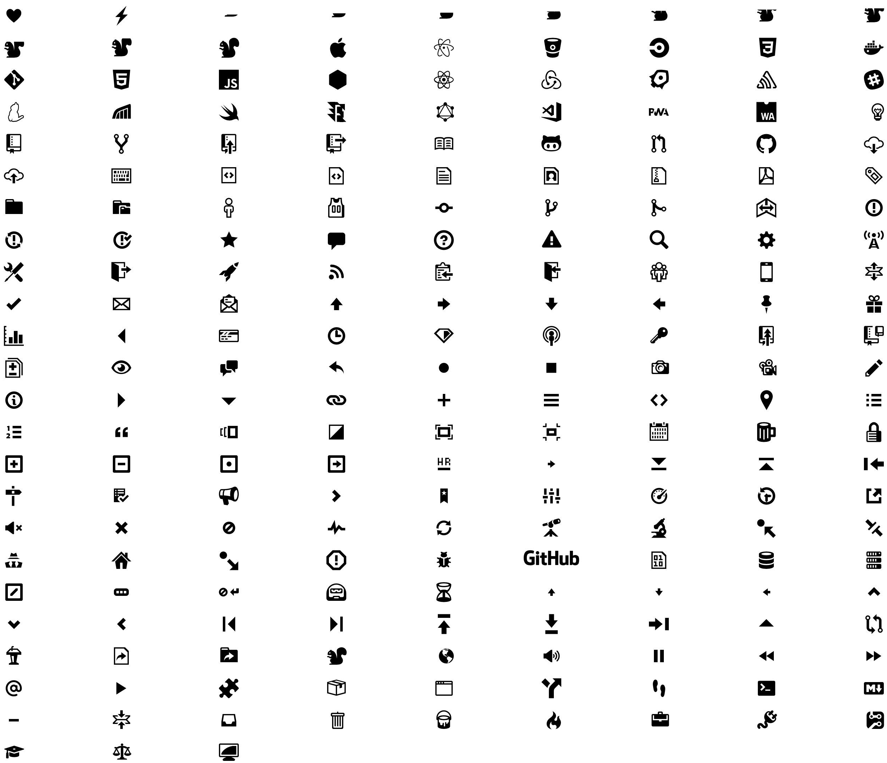

# Webicons ZSH theme

This [ZSH](http://www.zsh.org) is created for those that like Web Development and it's wide array of Open Source project icons. I has been created to work with my current [Oh-My-Zsh](http://ohmyz.sh) setup so without modification your mileage may vary.

# Projects

Some of the projects for which icons have been included are:

- [Atom](https://atom.io)
- [Bitbucket](https://bitbucket.org)
- [CircleCI](https://circleci.com)
- [Docker](https://docker.com)
- [Git](https://git-scm.com)
- [Node.js](https://nodejs.org)
- [React](https://reactjs.org)
- [Redux](https://redux.js.org)
- [Rkt](https://coreos.com/rkt/)
- [Sentry](https://sentry.io)
- [Slack](https://slack.com)
- [Yarn](https://yarnpkg.com)
- [Rollbar](https://rollbar.com)
- [Swift](https://swift.org)
- [Flow](https://flowtype.org)
- [Apollo GraphQL](https://apollographql.com)
- [Visual Studio Code](https://code.visualstudio.com)
- [Github Octicons](https://octicons.github.com)

I am not affiliated with nor working on any of these projects. I do not own any of these icons, therefore it may be necessary to remove one or more at the original authors request.

# Icons

Icons packaged using [IcoMoon App](https://icomoon.io/app/).

# Screenshot

| Dark Theme        | Light Theme        |
| ----------------- | ------------------ |
| ![alt text][dark] | ![alt text][light] |

[dark]: ./screenshots/light.png "Dark Theme"
[light]: ./screenshots/dark.png "Light Theme"
